# 零拷贝详解：从小白到精通

## 一、什么是零拷贝？

想象一下这个场景：你在餐厅点了一份外卖披萨。

**传统方式（多次倒手）**：

1. 厨师做好披萨放在厨房台子上 🍕
2. 服务员A从厨房拿到前台
3. 服务员B从前台拿到打包区
4. 服务员C从打包区拿给外卖员
5. 外卖员才能送给你

**零拷贝方式（直达）**：

- 厨师做好披萨 → 直接递给外卖员 → 送到你手上 🚀

**核心思想**：披萨还是那个披萨，但减少了中间倒手的次数！

零拷贝就是**减少数据在内存中不必要的搬运次数**，让数据传输更高效。

---

## 二、传统数据传输（4次拷贝）

### 场景：从磁盘读取文件，通过网络发送出去

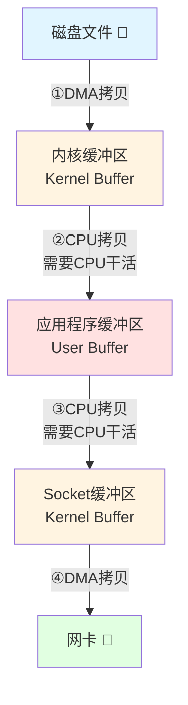

### 详细步骤说明：

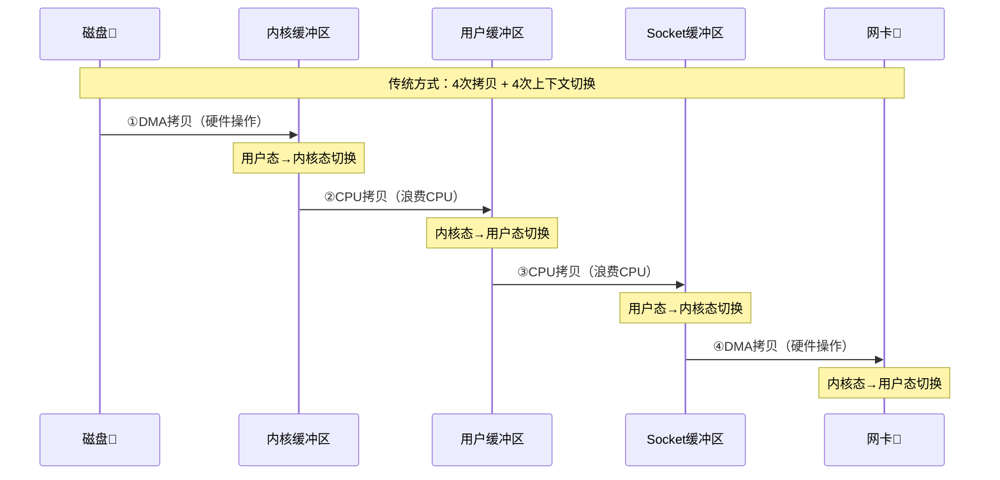

### Java代码示例：

```java
// 传统IO：披萨被倒手4次！
File file = new File("data.txt");
FileInputStream in = new FileInputStream(file);
byte[] buffer = new byte[4096];

// 步骤①②：从磁盘读到用户空间
int len = in.read(buffer);  

// 步骤③④：从用户空间写到网卡
socket.getOutputStream().write(buffer, 0, len);
```

**问题分析**：

| 步骤 | 从哪里       | 到哪里       | 拷贝方式 | 比喻              |
| ---- | ------------ | ------------ | -------- | ----------------- |
| ①   | 磁盘         | 内核缓冲区   | DMA拷贝  | 厨师做好披萨      |
| ②   | 内核缓冲区   | 用户缓冲区   | CPU拷贝  | 服务员A拿到前台   |
| ③   | 用户缓冲区   | Socket缓冲区 | CPU拷贝  | 服务员B拿到打包区 |
| ④   | Socket缓冲区 | 网卡         | DMA拷贝  | 外卖员送出去      |

---

## 三、操作系统零拷贝技术

### 方案1：mmap（内存映射）- 3次拷贝

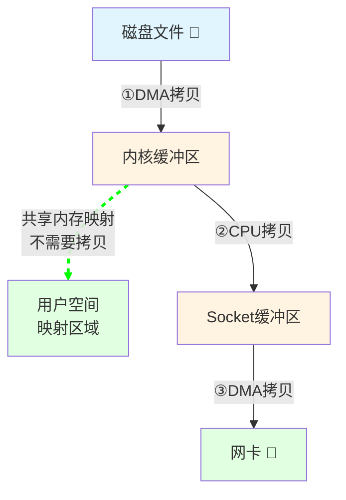

**比喻**：厨房和前台打通了，服务员不用搬披萨，直接在窗口就能看到和操作！

```java
// Java NIO的mmap
FileChannel fileChannel = new FileInputStream("data.txt").getChannel();
MappedByteBuffer mappedBuffer = fileChannel.map(
    FileChannel.MapMode.READ_ONLY, 0, fileChannel.size()
);
socketChannel.write(mappedBuffer);  // 减少1次拷贝
```

---

### 方案2：sendfile（真正的零拷贝）- 2次拷贝

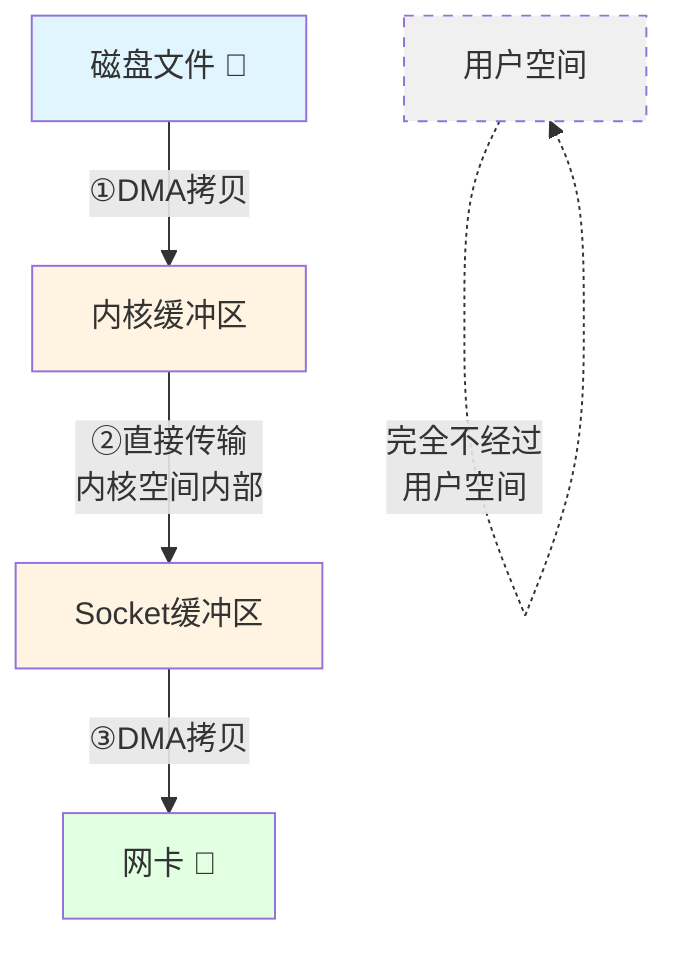

**比喻**：厨师做好披萨，直接从厨房窗口递给外卖员，中间服务员全部省略！

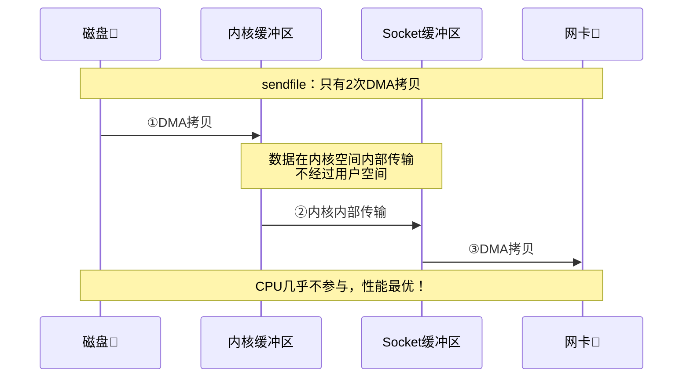

```java
// Java NIO的零拷贝：最优方案
FileChannel sourceChannel = new FileInputStream("data.txt").getChannel();
SocketChannel socketChannel = SocketChannel.open();

// 底层使用sendfile系统调用
sourceChannel.transferTo(0, sourceChannel.size(), socketChannel);
```

---

### 方案3：splice（Linux管道）


---

## 四、Netty的零拷贝（应用层优化）

Netty的零拷贝是**更广义的概念**，包含多个层面的优化。

### 1️⃣ Direct Buffer（直接内存）

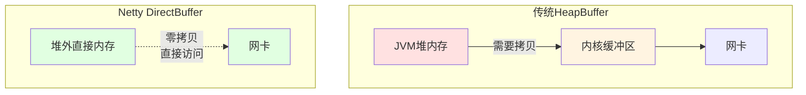

**比喻**：

- **HeapBuffer**：披萨放在店里的盒子，外卖员来了还要换成外卖盒
- **DirectBuffer**：披萨直接放在外卖盒里，外卖员直接拿走

```java
// Netty使用直接内存
ByteBuf directBuf = Unpooled.directBuffer(256);
directBuf.writeBytes("Hello Netty".getBytes());
channel.writeAndFlush(directBuf);  // 无需拷贝到内核
```

---

### 2️⃣ CompositeByteBuf（组合缓冲区）

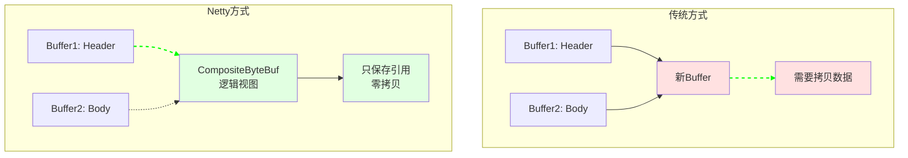

**比喻**：

- **传统方式**：把两个披萨重新装到一个大盒子里（需要搬运）
- **Netty方式**：用一根绳子把两个披萨盒绑在一起（不需要搬运）

```java
// Netty组合缓冲区
CompositeByteBuf composite = Unpooled.compositeBuffer();
ByteBuf header = Unpooled.buffer(10);
ByteBuf body = Unpooled.buffer(100);

// 零拷贝组合：只是逻辑上组合，不拷贝数据
composite.addComponents(true, header, body);
```

---

### 3️⃣ Slice（切片）

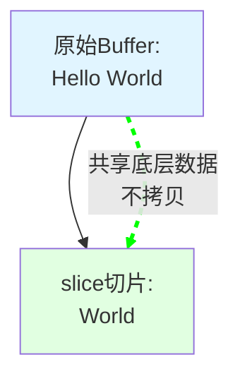

**比喻**：

- **传统方式**：从大披萨上切一块，放到新盘子里（拷贝）
- **Slice方式**：直接在大披萨上标记"这块是你的"（共享）

```java
ByteBuf buffer = Unpooled.copiedBuffer("Hello World", CharsetUtil.UTF_8);

// slice只是创建视图，共享底层数据
ByteBuf slice = buffer.slice(6, 5);  // "World"

System.out.println(slice.toString(CharsetUtil.UTF_8));  // 输出: World
// slice和buffer共享数据，修改一个会影响另一个
```

---

### 4️⃣ FileRegion（文件传输）

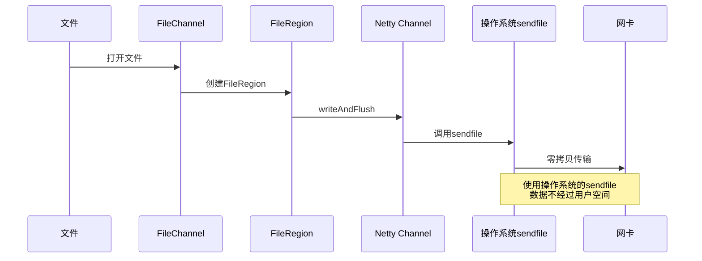

```java
// Netty零拷贝传输大文件
FileChannel fileChannel = new FileInputStream("movie.mp4").getChannel();
DefaultFileRegion fileRegion = new DefaultFileRegion(
    fileChannel, 0, fileChannel.size()
);

// 底层使用sendfile，零拷贝传输
channel.writeAndFlush(fileRegion);
```

---

## 五、性能对比可视化

```mermaid
gantt
    title 传输1GB文件的性能对比
    dateFormat X
    axisFormat %s秒
  
    section 传统IO
    4次拷贝+4次切换 :0, 10
  
    section mmap
    3次拷贝+4次切换 :0, 6
  
    section sendfile
    2次拷贝+2次切换 :0, 3
  
    section Netty零拷贝
    sendfile+应用优化 :0, 2
```

**性能提升**：

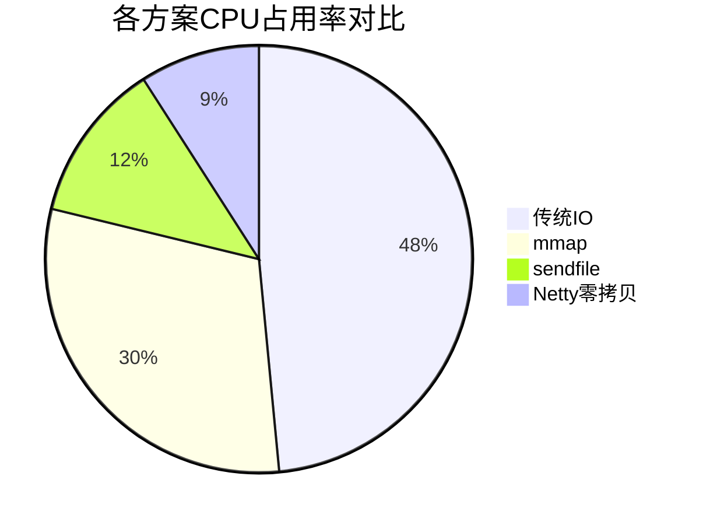

---

## 六、完整流程对比

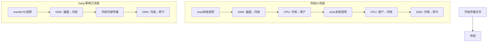